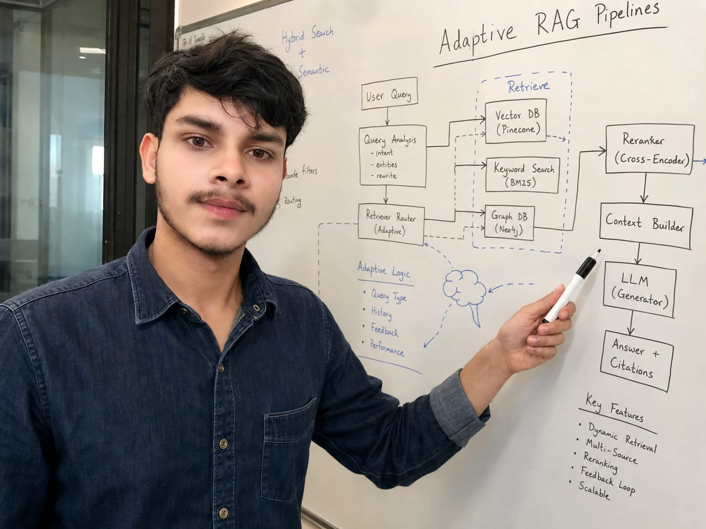

# Hi there, I'm Mithilesh Kumar 👋

  <b>AI Engineer & Backend Systems Developer</b> 
  <i>Building autonomous AI applications, agentic workflows, scalable backend systems, and high-performance RAG pipelines.</i>

  
  
  
  
  

---

## 📖 About Me & My Personal Journey

I am **Mithilesh Kumar**, an AI Engineer and Computer Science Engineering Student originally from **Ranghatta Village (Katoria Block, Banka District, Bihar, India)**, currently pursuing my B.Tech in Computer Science & Engineering at **Chandigarh Engineering College (CEC), CGC Landran, Mohali, Punjab (2023–2027)** with a **CGPA of 8.6/10**.

My engineering and technical mindset was shaped through years of self-discipline, adaptability, and hostel life across different parts of Bihar before moving to Punjab for higher education:
* **Early Education:** Started at **Awasiya Gyan Niketan School** (Bhagalpur, Bihar).
* **Primary Schooling:** Completed primary schooling at **Adwaita Mission High School, Mandar Vidyapith** (Banka, Bihar).
* **Secondary Schooling (Class 5–10):** Completed CBSE Matriculation at **S.K.P. Vidya Vihar School** (Banka, Bihar) with **68%**.
* **Intermediate Science (12th PCM):** Completed I.Sc. from **S.S.P. Yadav College, Katoria** (Banka, Bihar - BSEB) with **88.2% (441/500)**.
* **Current Degree:** Pursuing B.Tech CSE at **CEC CGC Landran, Mohali** (Affiliated with IKGPTU) with **8.6 CGPA**.

From a small village in Bihar to engineering autonomous multi-agent AI systems and high-throughput backend APIs in Punjab, my journey is driven by continuous learning, consistency, and a strong desire to solve real-world problems through modern software engineering.

  
  
  

  <i>Building autonomous AI systems & high-performance backend pipelines</i>

---

## 👤 Executive Profile & Summary

| Attribute | Details |
| --- | --- |
| **Full Name** | Mithilesh Kumar |
| **Primary Role** | AI Engineer & Backend Systems Specialist |
| **Hometown / Origin** | Ranghatta Village, Katoria, Banka, Bihar, India |
| **Current Location** | Mohali / Chandigarh, Punjab, India |
| **University** | Chandigarh Engineering College (CEC), CGC Landran, Mohali |
| **Academic Standing** | B.Tech CSE (2023–2027) — **CGPA: 8.6 / 10** |
| **12th Score** | **88.2% (441/500)** — S.S.P. Yadav College, Banka |
| **Official Email** | mithxcode@gmail.com |
| **Portfolio Website** | [mithilesh-kumar-ai-engineer.netlify.app](https://mithilesh-kumar-ai-engineer.netlify.app/) |
| **LinkedIn** | [linkedin.com/in/mithileshkumar001](https://www.linkedin.com/in/mithileshkumar001) |
| **X (Twitter)** | [@MITHILESH_7781](https://x.com/MITHILESH_7781) |

  

  

  

  <i>From Banka, Bihar to CEC Chandigarh — AI Engineering Journey</i>

 

Aapko
---

## 🚀 Core Expertise & Technical Stack

- **Languages:** `Python`, `C++`, `C`, `JavaScript`, `SQL`
- **AI & LLMs:** `LangChain`, `LangGraph`, `OpenAI API`, `Gemini API`, `RAG`, `Prompt Engineering`, `Semantic Search`, `Embeddings`
- **Backend & APIs:** `FastAPI`, `Node.js`, `Express.js`, `REST APIs`, `JWT Authentication`, `RBAC`
- **Software Engineering:** `OOP`, `SDLC`, `Software Testing`, `Debugging`, `Code Review`, `MVC Architecture`, `Algorithm Design`, `Problem Solving`
- **Databases & Vector DBs:** `MongoDB`, `PostgreSQL`, `MySQL`, `Pinecone Vector Database`, `ChromaDB`
- **Frontend & Web:** `HTML5`, `CSS3`, `JavaScript`, `React.js`, `Streamlit`
- **Core CS:** `Data Structures & Algorithms`, `DBMS`, `Operating Systems`, `Computer Networks`
- **DevOps & Tools:** `Docker`, `Git`, `GitHub Actions`, `Postman`, `VS Code`

---

## 📌 Featured Work & Projects

### 1. 🤖 Multi-Agent AI Research & Automated Report Generation Platform
> **Autonomous Multi-Agent System for Dynamic Web Research & Document Synthesis**
* 🔗 **Repository:** [`mithxcode/multi-document-rag-system`](https://github.com/mithxcode/multi-document-rag-system)
* 🛠️ **Tech Stack:** `Python`, `FastAPI`, `LangGraph`, `Gemini API`, `Tavily API`, `MongoDB`, `Streamlit`, `ReportLab`, `python-docx`

- **Agentic Workflow Orchestration:** Built an autonomous multi-agent graph using **LangGraph** to coordinate specialized agents (*Planner*, *Researcher*, *Fact-Verifier*, *Summarizer*, and *Report Writer*).
- **Asynchronous Backend Services:** Architected high-throughput, async RESTful microservices with **FastAPI** featuring Pydantic data validation, dynamic state management, error boundaries, and structured logging.
- **Automated Document Synthesis:** Integrated Google Gemini LLMs and Tavily Search API with `ReportLab` and `python-docx` to synthesize raw web data into formatted, publication-ready PDF and DOCX reports with automated table-of-contents and citation tracking.

---

### 2. 🔍 Knowledge Management & Advanced Document Search Engine
> **Enterprise-Grade RAG Pipeline with Semantic Retrieval & Vector Indexing**
* 🔗 **Repositories:** [`mithxcode/pdf-rag-chatbot`](https://github.com/mithxcode/pdf-rag-chatbot) | [`mithxcode/Adaptive-Rag`](https://github.com/mithxcode/Adaptive-Rag)
* 🛠️ **Tech Stack:** `Python`, `FastAPI`, `LangChain`, `Pinecone Vector DB`, `ChromaDB`, `OpenAI API`, `Gemini API`, `Streamlit`

- **High-Performance RAG Architecture:** Developed an end-to-end Retrieval-Augmented Generation pipeline handling dynamic PDF document ingestion, recursive text chunking, and dense embedding generation.
- **Vector Search & Semantic Retrieval:** Integrated **Pinecone** and **ChromaDB** vector stores to enable sub-second vector similarity searches with metadata filtering for accurate contextual grounding.
- **Hallucination Mitigation:** Applied adaptive retrieval and hybrid prompt engineering techniques with LangChain to minimize LLM hallucinations during multi-document QA sessions.

---

### 3. 🏫 CGC-NEXUS — Integrated Campus Event Management Platform
> **Full-Stack Enterprise Event Coordination & Analytics Hub**
* 🔗 **Repository:** [`mithxcode/CGC-NEXUS`](https://github.com/mithxcode/CGC-NEXUS)
* 🛠️ **Tech Stack:** `React.js`, `Node.js`, `Express.js`, `MongoDB`, `JWT`, `REST APIs`, `Tailwind CSS`

- **Full-Stack Architecture:** Built a production-grade campus event portal using the MERN stack following strict **MVC architecture** to streamline student registrations, club management, and event workflows.
- **Role-Based Security:** Engineered secure REST APIs using **JWT Authentication** and **Role-Based Access Control (RBAC)** to manage admin, organizer, and student access levels.
- **Optimized Data Pipeline:** Optimized MongoDB queries and schema modeling, enabling real-time participation tracking and automated notification triggers.

---

### 4. 🛡️ StopScams.in — AI-Powered Fraud Detection Engine
> **Real-Time Phishing & Scam Analysis Web Application**
* 🛠️ **Tech Stack:** `Python`, `FastAPI`, `React.js`, `OpenAI API`, `Natural Language Processing`

- **Security & Pattern Analysis:** Developed an AI-assisted security utility that parses incoming SMS, emails, and transaction notes to detect phishing patterns and malicious URLs.
- **Instant Risk Scoring:** Leveraged NLP algorithms and LLM analysis to deliver real-time risk scores and actionable safety advice to prevent digital scams.

---

### 5. 🍏 ALIMENTO — Smart Food Waste Reduction Platform
> **Sustainable Food Redistribution & Expiry Tracking Ecosystem**
* 🛠️ **Tech Stack:** `Node.js`, `Express.js`, `MongoDB`, `React.js`, `Geolocation APIs`

- **Automated Inventory Tracking:** Designed a smart web platform to track item shelf life and trigger automated alerts before expiration.
- **Community Logistics:** Connected local restaurants and households with food banks and charitable organizations through real-time geolocation matching.

---

### 6. 💰 MoneyPulse — Personal Finance Management CLI & Analytics
> **High-Performance Command-Line Expense Engine**
* 🔗 **Repositories:** [`mithxcode/Personal-Finance-Smart-Tracker`](https://github.com/mithxcode/Personal-Finance-Smart-Tracker) | [`mithxcode/Finance-Dashboard`](https://github.com/mithxcode/Finance-Dashboard)
* 🛠️ **Tech Stack:** `C++`, `File Handling`, `Data Structures`, `Object-Oriented Programming`

- **Core Engine & Persistence:** Engineered a CLI application using modern C++ principles, featuring dynamic budget allocation, persistent file storage, and audit logs.
- **Data Analysis:** Implemented efficient data structures to compute monthly spending summaries, categorization metrics, and transaction histories.

---

## 📊 GitHub Analytics & Activity

  
  

---

## 🏆 Achievements & Recognition

- **🥇 Winner — College Hackathon (2026):** Developed a Multi-Agent AI Research & Automated Report Generation Platform using LangGraph, RAG, Pinecone, and Gemini API.
- **🥈 2nd Place — College Coding Competition (2024):** Recognized for strong problem-solving skills in Data Structures & Algorithms.

---

## 📜 Certifications & Learning Highlights

- **AWS Academy Cloud Foundations / Graduate** (AWS Academy)
- **Agentic AI Specialist Certification** (Udemy)
- **Front-End Software Engineering Certification**
- **Prompt Engineering Certification** (Infosys Springboard)
- **Python & C++ Programming** Certifications
- **SQL Database Management** Certification
- **BCG X & NASSCOM** Professional Certifications

---

## 📝 Articles & Publications

- 📝 **Dev.to Article 1:** [Building Scalable Multi-Agent Workflows & RAG Pipelines with LangGraph and FastAPI](https://dev.to/mithxcode)
- 📝 **Dev.to Article 2:** [Why Basic RAG Fails in Production and How Adaptive Query Routing Fixes It](https://dev.to/mithxcode)
- 🌐 **Interactive Portfolio:** Explore projects and live demos at [mithilesh-kumar-ai-engineer.netlify.app](https://mithilesh-kumar-ai-engineer.netlify.app/)
---

  📫 <b>Get in Touch:</b> Connect with me on <a href="https://www.linkedin.com/in/mithileshkumar001">LinkedIn</a>, send an email to <a href="mailto:mithxcode@gmail.com">mithxcode@gmail.com</a>, or explore my live projects on my <a href="https://mithilesh-kumar-ai-engineer.netlify.app/">Portfolio Website</a>.

---

  <i>From Banka, Bihar to building scalable software and AI systems in Chandigarh, Punjab. Driven by code, structure, and problem-solving. 🚀</i>

